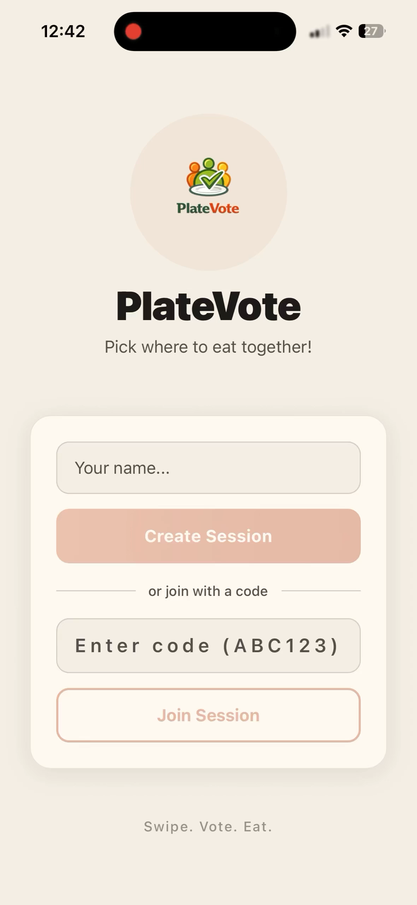

<div align="center">


# PlateVote

**Pick where to eat together!**

*Swipe. Vote. Eat.*

CMPE 131 — Group 9

</div>

---

## Demo

<video src="platevote/assets/PlateVote%20Demo%201.mp4" controls width="300"></video>

> If the video doesn't play above, download it directly: [`PlateVote Demo 1.mp4`](platevote/assets/PlateVote%20Demo%201.mp4)

<div align="center">

</div>

## About

PlateVote is a mobile application to solve the "where to eat" dilemma. Users create a session, invite friends via a code, and everyone swipes on restaurant options. The app tallies the votes and picks the winner.

**Core features:**
- Real-time lobby
- Live voting
- Smart results with tie-break
- Google Places restaurant suggestions
- Find a time that works for everyone

## Tech Stack

| Layer | Technology |
|-------|-----------|
| Frontend | React Native (Expo) + TypeScript |
| Backend | Supabase (PostgreSQL + Realtime) |
| Navigation | Expo Router |
| API | Google Places |

## Getting Started

**Prerequisites:** Node.js, Expo Go app on your device

1. **Clone & install**
   ```bash
   git clone https://github.com/JoelMoyal/CMPE131-Group9-.git
   cd platevote
   npm install
   ```

2. **Environment setup**
   ```bash
   cp .env.example .env
   ```
   Then add your keys to `.env`:
   - `EXPO_PUBLIC_SUPABASE_URL`
   - `EXPO_PUBLIC_SUPABASE_ANON_KEY`
   - `EXPO_PUBLIC_GOOGLE_PLACES_API_KEY` *(optional — without it the app uses sample data)*

3. **Run**
   ```bash
   npx expo start
   ```
   Scan the QR code with Expo Go (Android) or Camera (iOS), or press `a`/`i` for emulators.

## Docs

- [Architecture](docs/architecture.md)
- [Foundation Guide](group-project-foundation-guide-updated.md)
